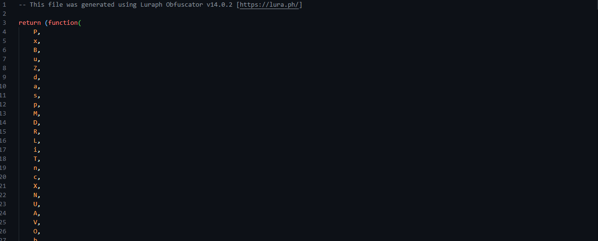

  

<h1 align="center">lua-obfuscators</h1>

A curated list of [Lua](https://lua.org) (5.1 – 5.4, LuaJIT) and [Luau](https://luau-lang.org) obfuscators.

Inspired by the [portfolio-ideas](https://github.com/Evavic44/portfolio-ideas) list.

> 👋 We're looking for contributors to make this project alive!

## Table of Contents

- [IronBrew2](/obfuscators/ironbrew2/README.md)

## Contributing

Contributions are welcome!
Please read the [contribution guidelines](/CODE_OF_CONDUCT.md) on how to do that;

## License

This project is licensed under the MIT License, see [LICENSE](/LICENSE) for more details.
